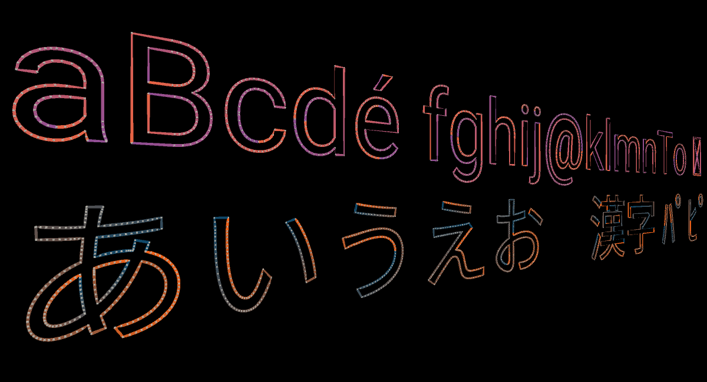
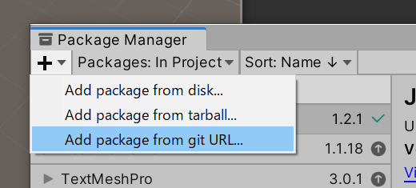
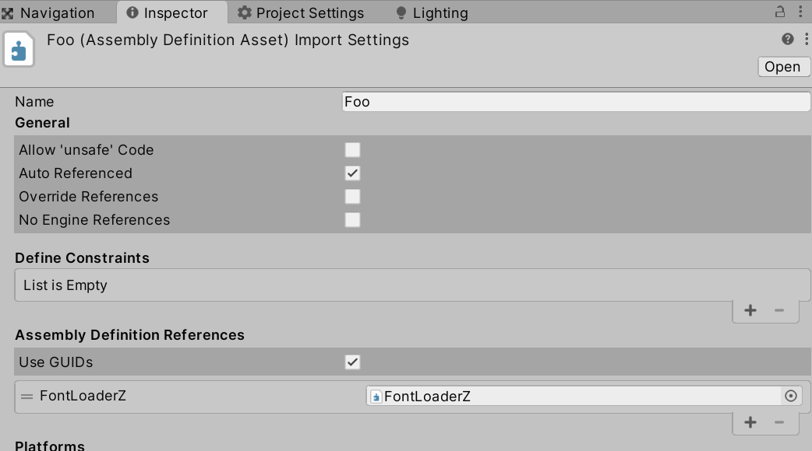

# FontLoaderZ



A simple font loader for Unity.

This library provides a function to get contour points from a font binary.

It supports TTF and OTF fonts.

This library does not include a mesh generator.

If you want to generate glyph meshs, <b>GlyphMeshZ</b> may help you. Please search <b>GlyphMeshZ</b> on Unity asset store.

## Requirement

- Unity2020 or higher

It may work with older version of Unity, but I haven't tested.

## License

MIT

## How to import package

1. Open the package manager window

2. Select <b>Add package from git URL</b>



3. Input the url below

https://github.com/fumobox/FontLoaderZ.git?path=/Packages/FontLoaderZ

## Usage

Please see an example scene and code.

## Tips

To read a font as text asset, an extension of file must be changed to <b>.bytes</b>.

```
Roboto-Regular.ttf -> Roboto-Regular.bytes
```

You need to add <b>FontLoaderZ</b> to <b>Assembly Definition References</b>

